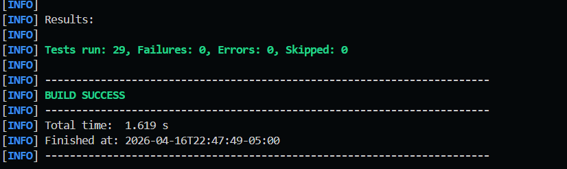
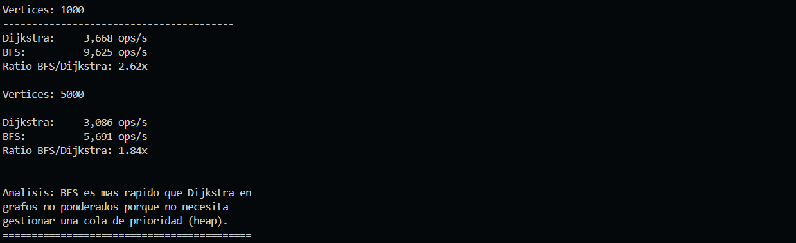

# Algoritmos sobre Grafos - Post-Contenido 2

Implementacion de algoritmos de grafos en Java 17+ con Maven.

## Algoritmos Implementados

### 1. Dijkstra

- **Proposito**: Encontrar el camino mas corto desde un vertice fuente a todos los demas vertices en un grafo con pesos no negativos.
- **Complejidad**: O((V + E) log V)
- **Caracteristicas**: Early termination cuando se encuentra el destino, reconstruccion de camino.

### 2. Bellman-Ford

- **Proposito**: Encontrar el camino mas corto desde un vertice fuente, soporta pesos negativos y detecta ciclos negativos.
- **Complejidad**: O(V \* E)
- **Caracteristicas**: Detecta ciclos negativos en la V-esima pasada.

### 3. Kruskal

- **Proposito**: Encontrar el Arbol de Expansion Minima (MST) en un grafo no dirigido ponderado.
- **Complejidad**: O(E log E)
- **Caracteristicas**: Usa UnionFind con path splitting y union by size.

### 4. Prim

- **Proposito**: Encontrar el Arbol de Expansion Minima (MST) en un grafo no dirigido ponderado.
- **Complejidad**: O((V + E) log V)
- **Caracteristicas**: Usa cola de prioridad para seleccionar la arista de menor peso.

### 5. Kahn (Ordenamiento Topologico)

- **Proposito**: Generar un orden topologico valido en un DAG (grafo dirigido aciclico).
- **Complejidad**: O(V + E)
- **Caracteristicas**: Lanza IllegalArgumentException si el grafo tiene ciclos.

### 6. Kosaraju (Componentes Fuertemente Conexas)

- **Proposito**: Encontrar todas las componentes fuertemente conexas en un grafo dirigido.
- **Complejidad**: O(V + E)
- **Caracteristicas**: Usa DFS en el grafo original y en su transpuesto.

## Estructura del Proyecto

```
src/
  main/java/com/grafos/
    WeightedDiGraph.java    - Grafo dirigido ponderado
    WeightedGraph.java      - Grafo no dirigido ponderado
    UnionFind.java          - Estructura Union-Find
    Dijkstra.java           - Algoritmo de Dijkstra
    BellmanFord.java        - Algoritmo de Bellman-Ford
    MST.java                - Algoritmos de Kruskal y Prim
    TopSort.java            - Algoritmo de Kahn
    SCC.java                - Algoritmo de Kosaraju
    BFS.java                - Busqueda en anchura
  test/java/com/grafos/
    DijkstraTest.java
    BellmanFordTest.java
    MSTTest.java
    TopSortTest.java
    SCCTest.java
    BFSTest.java
    UnionFindTest.java
  jmh/java/com/grafos/
    GraphBenchmark.java     - Benchmark JMH
```

## Compilacion y Ejecucion

### Compilar el proyecto

```bash
mvn compile
```

### Ejecutar tests

```bash
mvn test
```

### Ejecutar Benchmark JMH

```bash
mvn package
java -jar target/benchmarks.jar
```

## Benchmark: Dijkstra vs BFS

Se comparo empiricamente el rendimiento de Dijkstra vs BFS en grafos no ponderados.

- BFS resuelve SSSP en O(V+E)
- Dijkstra lo hace en O((V+E) log V) pero con pesos uniformes = 1

### Resultados

```
Vertices: 1000
----------------------------------------
Dijkstra:     3,668 ops/s
BFS:          9,625 ops/s
Ratio BFS/Dijkstra: 2.62x

Vertices: 5000
----------------------------------------
Dijkstra:     3,086 ops/s
BFS:          5,691 ops/s
Ratio BFS/Dijkstra: 1.84x
```

### Analisis

| Vertices | BFS (ops/s) | Dijkstra (ops/s) | Ratio |
| -------- | ----------- | ---------------- | ----- |
| 1000     | 9,625       | 3,668            | 2.62x |
| 5000     | 5,691       | 3,086            | 1.84x |

**Conclusion:**

BFS es entre 1.8x y 2.6x mas rapido que Dijkstra en grafos no ponderados. Esto se debe a que:

1. **BFS** usa una cola simple (ArrayDeque) con operaciones O(1) para insertar/obtener
2. **Dijkstra** usa PriorityQueue con operaciones O(log V) para insertar/obtener
3. En grafos no ponderados, todos los pesos son 1, no hay necesidad de ordenar por peso, por lo que el heap es innecesario

**Conclusion teorica vs empirica:**

- Teorica: BFS O(V+E) vs Dijkstra O((V+E) log V)
- Empirica: Confirma que el factor log V tiene un costo significativo en grafos no ponderados

## Requisitos

- Java 17+
- Maven 3.6+

## Capturas de Pantalla

### Tests JUnit 5



*Figura 1: Ejecucion de tests JUnit 5 - 29 tests, todos exitosos*

### Benchmark Dijkstra vs BFS



*Figura 2: Resultados del benchmark comparando Dijkstra vs BFS en grafos no ponderados*
